# Humanoid Robot Perception Synthetic Data MLOps

Isaac Sim으로 휴머노이드 로봇의 head-mounted camera 시점 합성 데이터를 생성하고, 객체 탐지 모델을 학습한 뒤 API로 배포하고 모니터링하는 MLOps 프로젝트입니다.

## 목표

이 프로젝트는 휴머노이드 로봇이 작업 환경에서 바라보는 데이터를 synthetic data pipeline으로 생성해, 실제 라벨링 데이터 부족 문제를 해결하는 흐름을 보여줍니다.

- Isaac Sim Replicator 기반 humanoid egocentric 이미지/라벨 생성
- 머리 장착 카메라 시점의 depth, segmentation, bounding box 생성
- YOLO 객체 탐지 모델 학습
- MLflow 기반 실험 추적
- FastAPI 기반 추론 API
- Prometheus/Grafana 기반 서빙 모니터링
- Docker Compose 기반 재현 가능한 실행 환경

## Architecture

```text
Isaac Sim Replicator
  -> humanoid egocentric perception dataset
  -> YOLO training
  -> MLflow experiment tracking
  -> FastAPI inference service
  -> Prometheus/Grafana monitoring
```

## Project Visual Overview

### End-to-End Demo

Gradio 데모 UI에서 synthetic validation image를 업로드하면 YOLO 모델이 휴머노이드 로봇의 head-mounted camera 시점 객체를 탐지합니다.

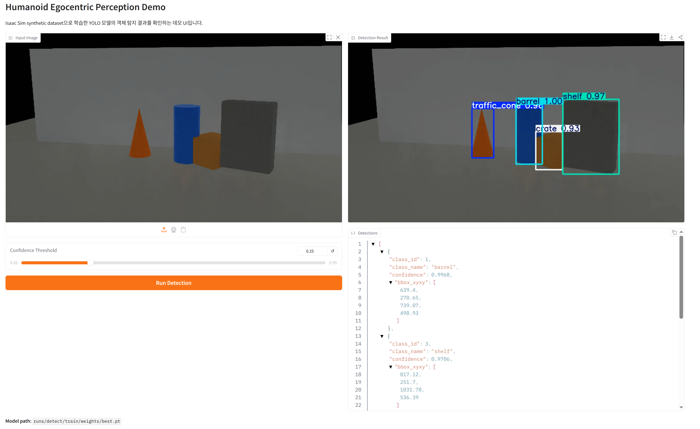

### Synthetic Data Generation

Isaac Sim에서 휴머노이드 로봇, 카메라, 조명, 작업 환경을 구성하고 Replicator로 RGB/segmentation/bounding box 데이터를 생성합니다.

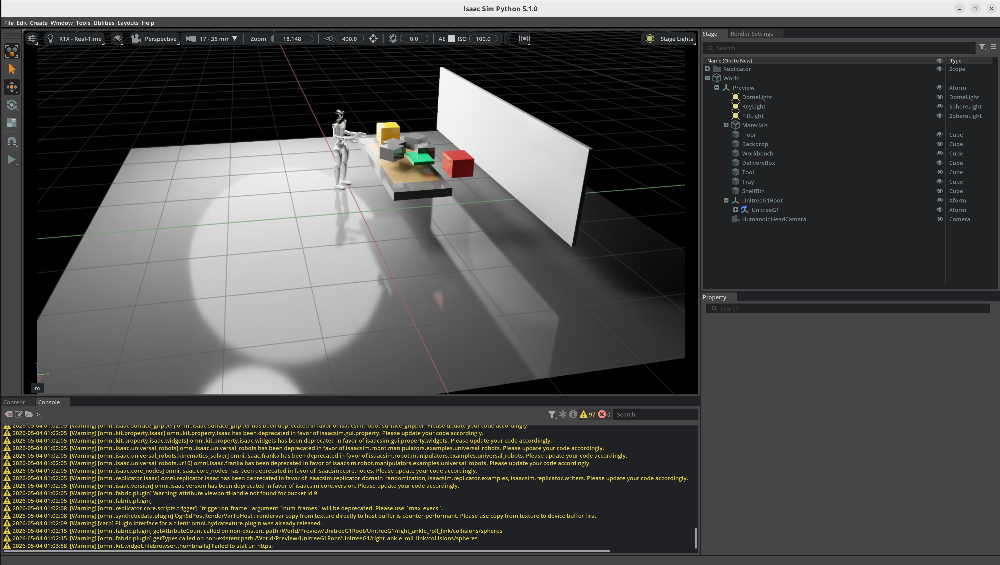

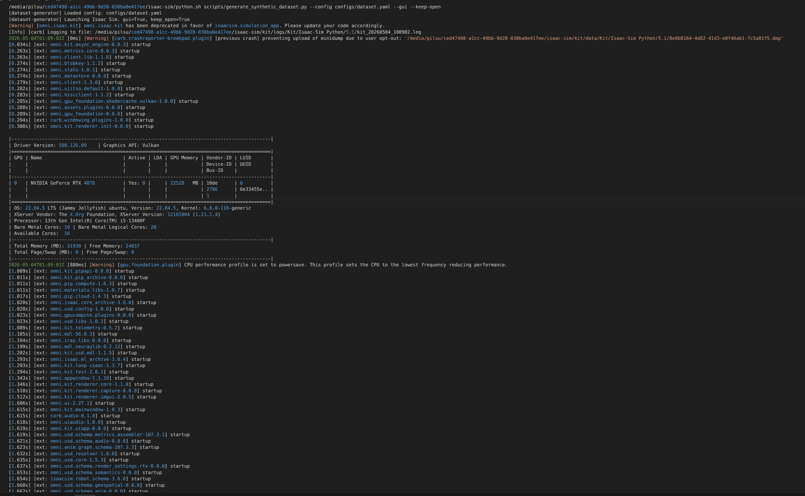

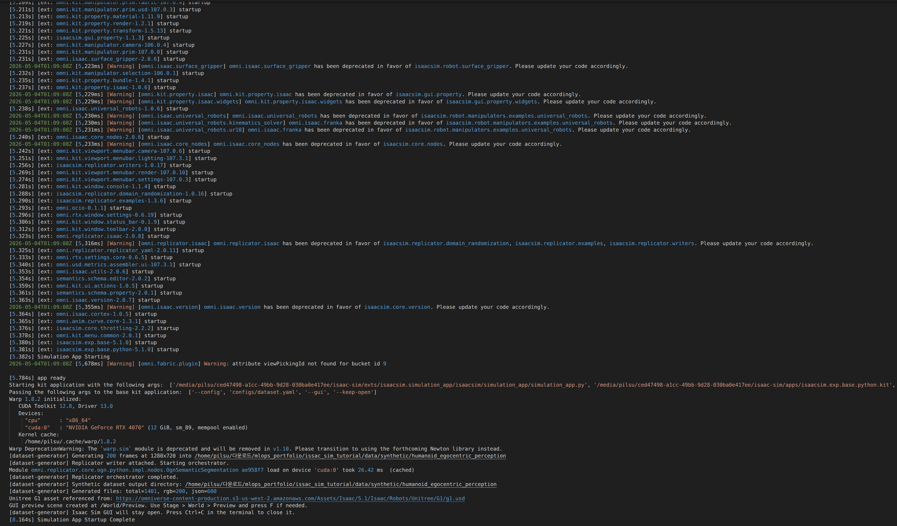

생성된 RGB 이미지와 semantic segmentation mask는 YOLO 학습 데이터셋으로 변환됩니다.

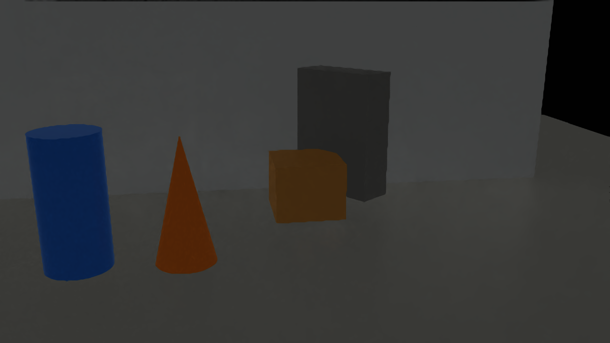

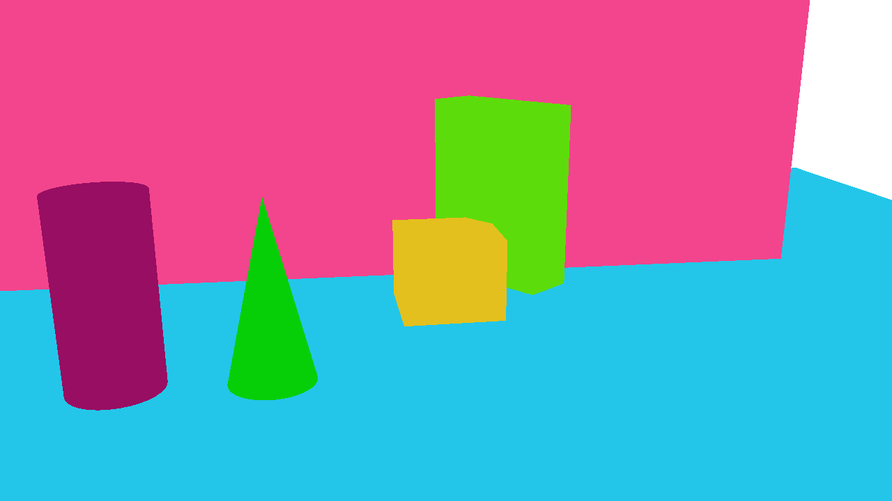

### YOLO Training Results

YOLO 학습 과정은 터미널 로그와 MLflow experiment tracking으로 추적하며, validation 결과와 confidence/precision/recall curve를 함께 확인합니다.

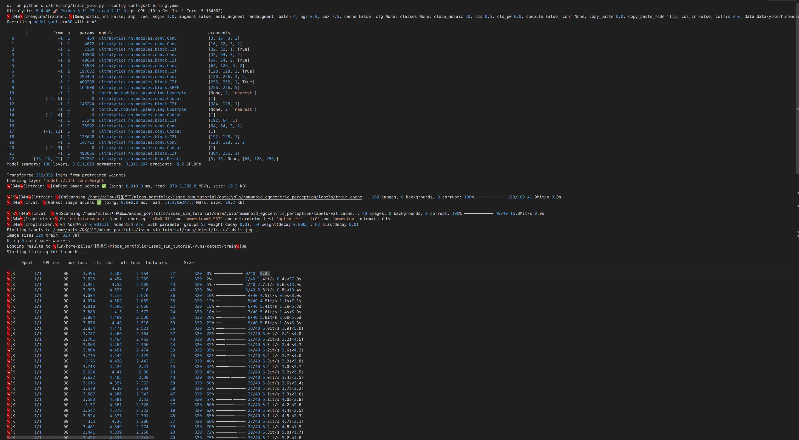

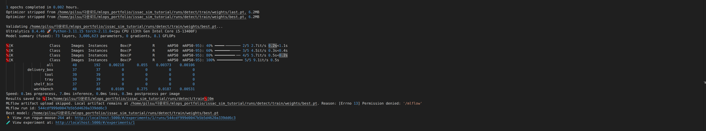

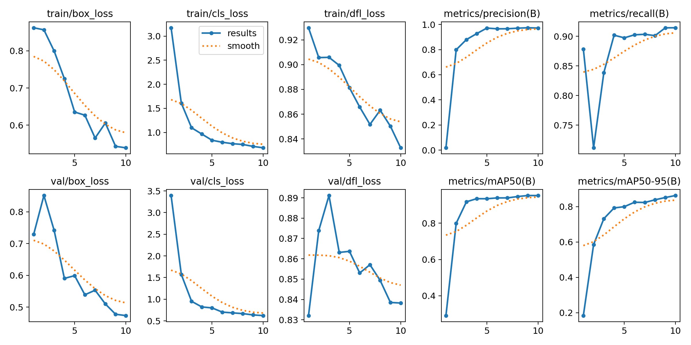

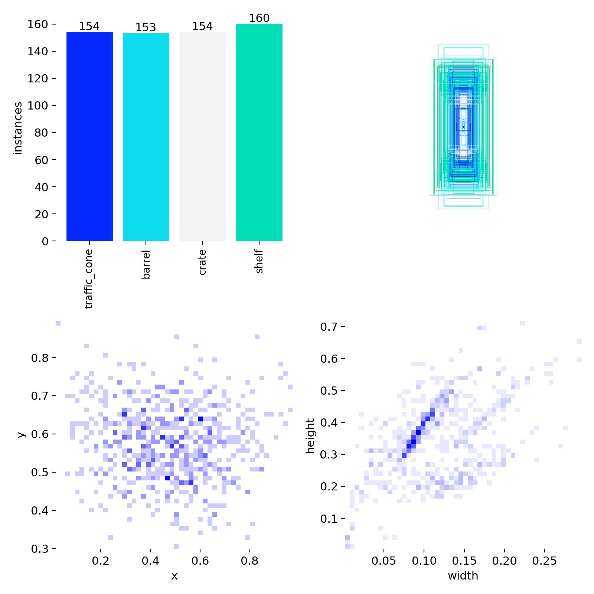

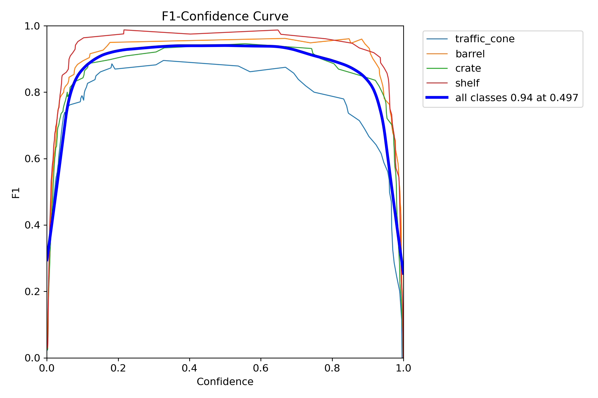

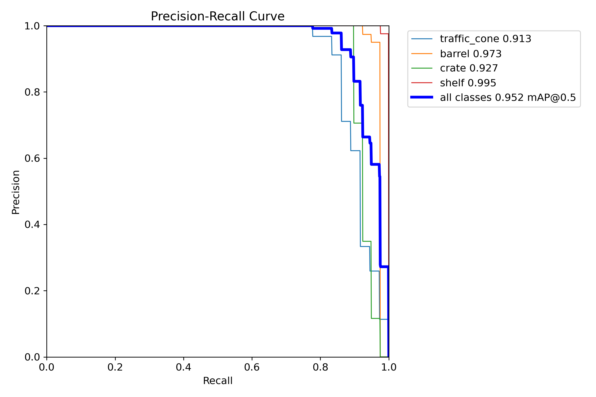

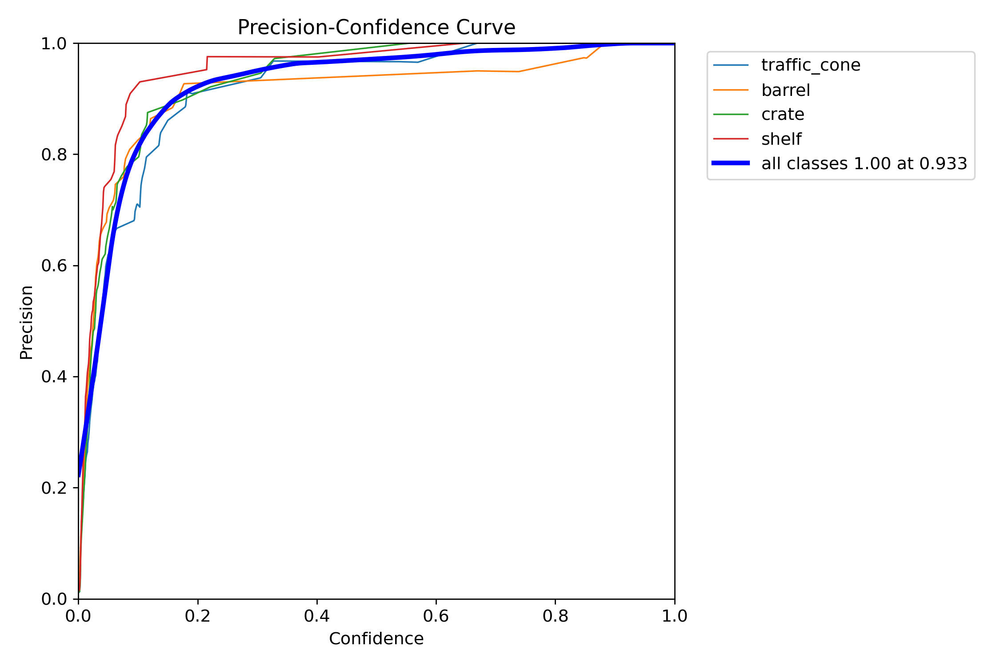

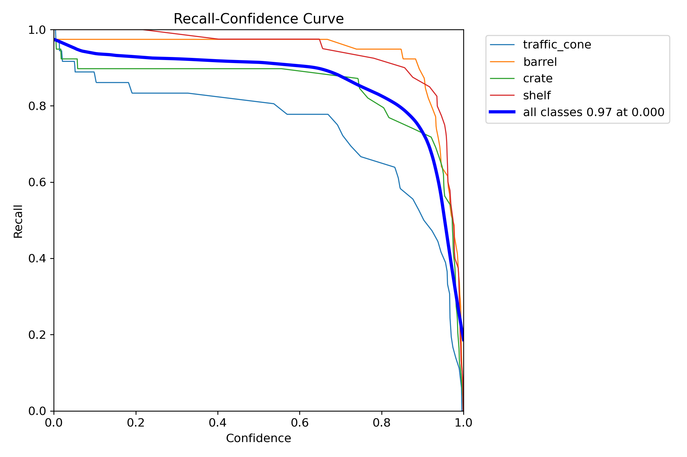

### Experiment Tracking and Monitoring

MLflow는 학습 run과 metric 비교를 관리하고, Prometheus/Grafana는 FastAPI 및 Gradio 추론 요청 수와 latency를 모니터링합니다.

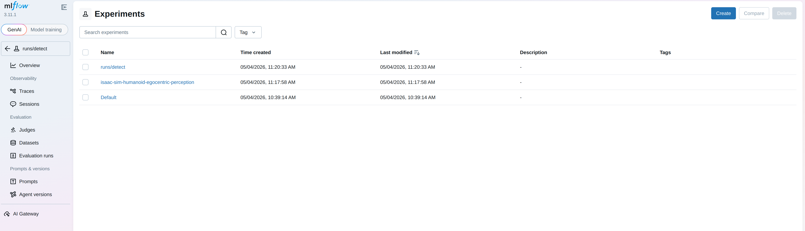

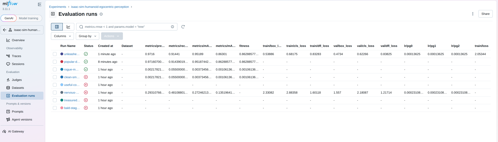

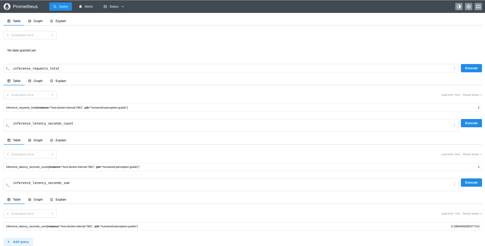

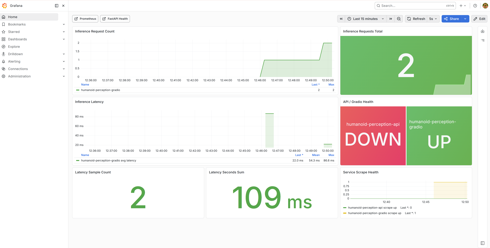

## Prerequisites

이 프로젝트는 synthetic data 생성을 위해 NVIDIA Isaac Sim 설치가 필요합니다. 학습/서빙 코드는 일반 Python 환경에서 실행되지만, `scripts/generate_synthetic_dataset.py`는 Isaac Sim의 `python.sh`로 실행해야 합니다.

- NVIDIA GPU 및 Isaac Sim을 실행할 수 있는 NVIDIA Driver
- NVIDIA Isaac Sim 설치본
- Isaac Sim 실행 파일: `<isaac-sim-install-path>/python.sh`
- `uv`
- Docker 및 Docker Compose

예시:

```bash
export ISAAC_SIM_PYTHON="/media/pilsu/ced47498-a1cc-49bb-9d28-030ba0e417ee/isaac-sim/python.sh"
```

## Project Structure

```text
.
├── configs/
│   ├── dataset.yaml
│   └── training.yaml
├── docs/
│   ├── imgs/
│   ├── humanoid-perception-mlops-project-introduction.pptx
│   └── ROADMAP.md
├── monitoring/
│   ├── grafana/
│   │   ├── dashboards/
│   │   └── provisioning/
│   └── prometheus.yml
├── scripts/
│   ├── convert_replicator_to_yolo.py
│   └── generate_synthetic_dataset.py
├── src/
│   ├── api/
│   │   └── app.py
│   ├── ui/
│   │   └── app.py
│   └── training/
│       └── train_yolo.py
├── docker-compose.yml
├── Dockerfile.api
├── Makefile
└── pyproject.toml
```

## Run Order

```text
1. uv 환경 준비
2. MLflow 서버 실행
3. Isaac Sim synthetic data 생성
4. Replicator output을 YOLO dataset으로 변환
5. YOLO 학습
6. FastAPI 추론 서버 실행
7. Gradio 데모 UI 실행
8. Prometheus/Grafana 모니터링 실행
```

## 1. Python 환경

이 프로젝트는 `uv`를 기준으로 의존성을 관리합니다.

```bash
cd ~/다운로드/mlops_portfolio/issac_sim_tutorial
curl -LsSf https://astral.sh/uv/install.sh | sh
uv sync
```

## 2. MLflow 서버 실행

학습 스크립트가 MLflow에 실험을 기록하므로, 학습 전에 먼저 MLflow 서버를 띄웁니다.

```bash
make mlflow
```

브라우저에서 확인합니다.

```text
http://localhost:5000
```

## 3. Isaac Sim 데이터 생성

Isaac Sim Python으로 synthetic dataset을 생성합니다. 외장하드에 설치된 Isaac Sim의 Python 실행 파일을 환경변수로 지정해서 사용합니다.

```bash
export ISAAC_SIM_PYTHON="/path/to/isaac-sim/python.sh" # ex)/media/pilsu/ced47498-a1cc-49bb-9d28-030ba0e417ee/isaac-sim/python.sh
make generate-data
```

Isaac Sim GUI를 띄우고 싶다면 아래 명령을 사용합니다. 데이터 생성이 끝나도 창을 유지하므로 터미널에서 `Ctrl+C`로 종료하면 됩니다.

```bash
unset HUMANOID_USD_PATH
make generate-data-gui
```

GUI preview는 Isaac Sim Assets에서 `Unitree G1`을 우선 로드합니다. 자동 탐색이 실패하면 Isaac Sim Content Browser에서 G1 asset을 우클릭해 URL을 복사한 뒤 직접 지정할 수 있습니다.

```bash
export HUMANOID_USD_PATH="<copied-g1-usd-url>"
make generate-data-gui
```

### Isaac Sim GUI 조작 팁

GUI preview가 뜨면 오른쪽 Stage에서 `World > Preview > UnitreeG1Root`를 선택한 뒤 아래 조작을 사용합니다.

- `F`: 선택한 객체로 화면 포커스
- `W`: 선택한 객체 이동
- `E`: 선택한 객체 회전
- `R`: 선택한 객체 스케일 조절
- `Alt + 마우스 왼쪽 드래그`: viewport 회전
- `Alt + 마우스 가운데 드래그`: viewport 이동
- `Alt + 마우스 오른쪽 드래그` 또는 마우스 휠: 줌인/줌아웃

로봇이 어둡게 보이면 상단 viewport 모드를 `RTX - Real-Time`에서 다른 lighting/rendering 모드로 바꾸거나, `UnitreeG1Root`를 선택하고 `F`를 누른 뒤 카메라 각도를 다시 잡습니다.

출력 예시는 `data/synthetic/humanoid_egocentric_perception` 아래에 저장됩니다.

## 4. YOLO 데이터셋 변환

Replicator의 `rgb_*.png`, `bounding_box_2d_tight_*.npy`, label JSON을 YOLO 학습 구조로 변환합니다. Isaac Sim RGB가 어둡게 저장될 수 있어, 기본 변환은 학습/데모용 auto exposure 보정을 함께 적용합니다.

```bash
make convert-data
```

출력 구조는 아래와 같습니다.

```text
data/yolo/humanoid_egocentric_perception/
├── images/train
├── images/val
├── labels/train
├── labels/val
└── dataset.yaml
```

## 5. 모델 학습

학습은 변환된 YOLO dataset과 실행 중인 MLflow 서버를 사용합니다.

```bash
make train
```

학습 설정은 `configs/training.yaml`에서 관리합니다. 학습 결과와 주요 metric은 MLflow에 기록됩니다.

정상 진행되면 아래와 비슷한 로그가 나옵니다.

```text
train: Scanning ...
val: Scanning ...
Epoch 1/5 ...
```

## 6. 추론 API 실행

FastAPI는 운영/백엔드용 모델 서빙 인터페이스입니다. 기본 포트는 `8000`입니다.

```bash
export MODEL_PATH="runs/detect/train/weights/best.pt"
make api
```

헬스 체크:

```bash
curl http://localhost:8000
curl http://localhost:8000/health
```

이미지 추론:

```bash
curl -X POST http://localhost:8000/predict \
  -F "file=@sample.jpg"
```

## 7. Gradio 데모 UI 실행

Gradio는 사람에게 보여주기 위한 데모 UI입니다. 기본 포트는 `7860`입니다. PPT 캡처나 데모 영상에는 이 화면이 가장 보기 좋습니다.
Gradio 추론 metric은 `7861` 포트에서 Prometheus 형식으로 노출됩니다.

```bash
export MODEL_PATH="runs/detect/train/weights/best.pt"
make ui
```

브라우저에서 접속합니다.

```text
http://localhost:7860
```

포트를 바꾸고 싶으면 `UI_PORT`를 지정합니다.

```bash
UI_PORT=7862 make ui
```

Gradio metric 포트를 바꾸고 싶으면 `UI_METRICS_PORT`를 지정합니다.

```bash
UI_METRICS_PORT=7862 make ui
```

샘플 이미지는 아래 경로에서 선택하면 됩니다.

```text
data/yolo/humanoid_egocentric_perception/images/val
```

## 8. 모니터링 실행

API 서버를 켠 상태에서 Prometheus/Grafana를 실행합니다.

```bash
make monitor
```

Grafana는 Prometheus datasource와 `Humanoid Perception API Inference Monitoring`
대시보드를 자동으로 로드합니다.

접속 주소:

```text
FastAPI API server: http://localhost:8000/docs
Gradio demo UI: http://localhost:7860
MLflow: http://localhost:5000
Prometheus: http://localhost:9090
Grafana: http://localhost:3000
```

캡처용 Prometheus query:

```promql
inference_requests_total
inference_latency_seconds_count
inference_latency_seconds_sum
```

위 metric은 FastAPI 추론과 Gradio 추론을 모두 포함합니다. Prometheus에서 source를 나눠 보고 싶으면 `job` label을 사용합니다.

```promql
inference_requests_total{job="humanoid-perception-api"}
inference_requests_total{job="humanoid-perception-gradio"}
```

캡처용 Grafana panel:

```text
Inference Request Count
Inference Latency
API Health
```

전체 스택을 한 번에 올리고 싶으면 아래 명령을 사용합니다.

```bash
make stack
```

## Project Message

> Built an end-to-end humanoid egocentric perception MLOps pipeline using NVIDIA Isaac Sim, YOLO, MLflow, FastAPI, Docker, and Prometheus/Grafana to address labeled data scarcity in robotics perception systems.

